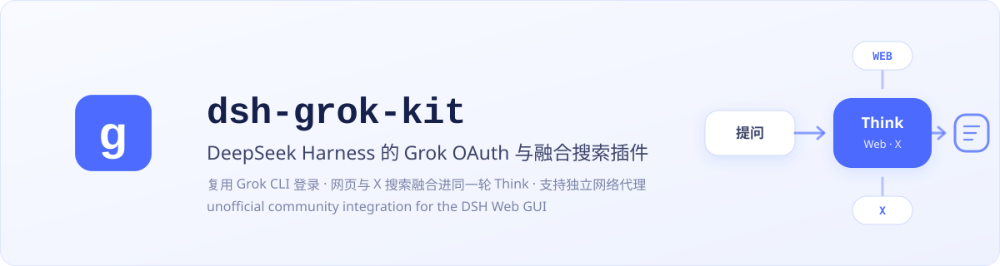
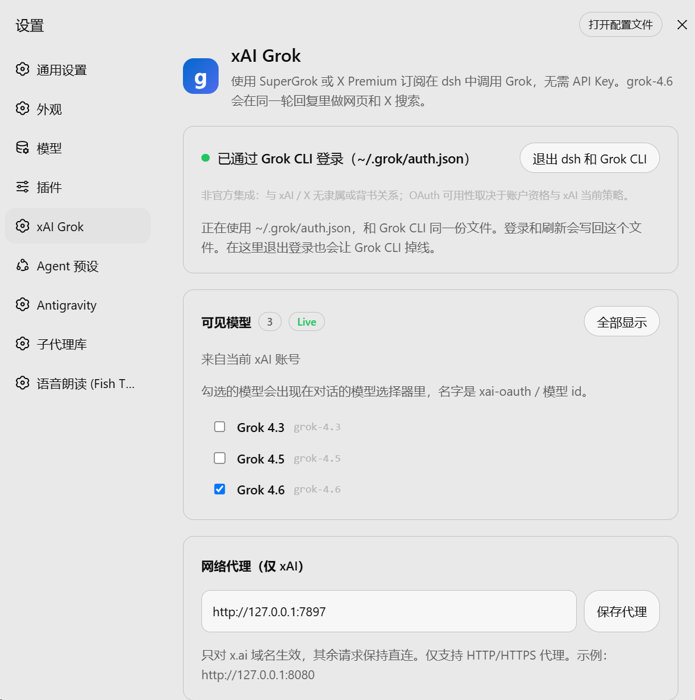
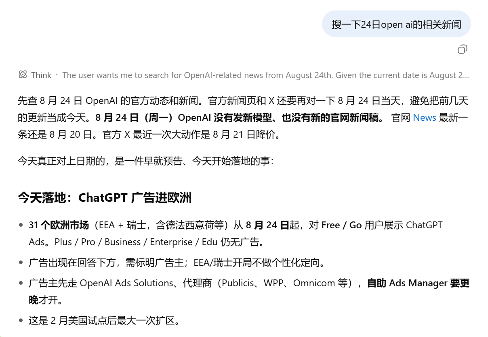
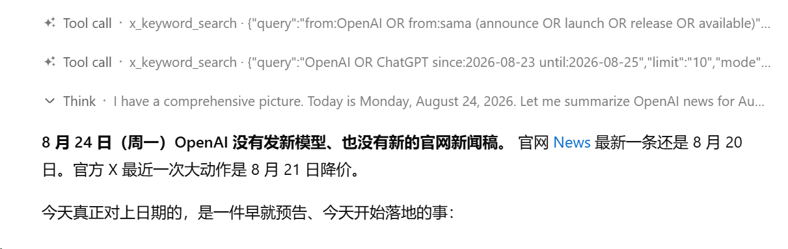

# dsh-grok-kit

[中文](README.md) · **English**

<p align="center">
  
</p>

<p align="center">
  <a href="https://github.com/MaRi23333/dsh-grok-kit/actions/workflows/ci.yml"></a>
  <a href="LICENSE"></a>
  
  
</p>

> Use an eligible SuperGrok or X Premium subscription in DeepSeek Harness through OAuth, with web/X search in the main model turn, continuous reasoning, Imagine, and an xAI-only proxy.

> [!IMPORTANT]
> **Unofficial project, trademark, and account-use notice**
>
> `dsh-grok-kit` is an independently developed, third-party community plugin for DeepSeek Harness. It is not an official product of, or representative of, xAI, X, DeepSeek, DeepSeek Harness, or their maintainers, and it does not claim product-specific permission, sponsorship, endorsement, or approval from them. Grok, xAI, X, DeepSeek, DeepSeek Harness, and related names and marks belong to their respective owners and are used only to identify compatible services accurately.
>
> OAuth availability may depend on subscription tier, region, xAI terms, account entitlement, rate limits, and future service changes. Users are responsible for confirming that their account and use are permitted. This project does not guarantee continued access or compatibility and does not provide xAI/Grok accounts, subscriptions, or official support.

## More than OAuth sign-in

`dsh-grok-kit` adds a separate `xai-oauth` route to [DeepSeek Harness](https://github.com/deepseek-ai/deepseek-harness). It does not require `XAI_API_KEY` or patch dsh source code. The point is not only to sign in, but to bring server-side search and the fields required for continuous reasoning into the main chat path.

- **Search in the main loop:** web and X lookup occurs inside grok-4.6's current Think turn, so reasoning can use newly found material immediately
- **Continuous multi-turn reasoning:** high effort is the default, with `reasoning.encrypted_content` preserved for the next turn
- **Sign-in stays in sync with Grok CLI:** the plugin shares and writes back `~/.grok/auth.json` instead of copying once and rotating refresh tokens separately
- **Imagine with a clean model picker:** `grok_imagine` is enabled by default, while non-chat models stay out of the conversation picker

Supporting behavior includes an xAI-only proxy, forced refresh and one retry on chat 401, atomic credential writes, and diagnostic redaction.

## Search in the main model turn

The same model id does not guarantee the same experience across integrations. [xAI documents that `grok-4.6` is available in both Grok Build and the public API](https://docs.x.ai/build/overview); the important search difference is whether server-side tools share the main conversation request.

**Separate search** sends another model request to retrieve or summarize material before returning it to the main conversation. That path remains useful when explicit filters are needed, but adds another model round, and its search summary is not produced inside the current reply's Think turn.

**Main-turn search** follows [xAI's server-side Responses search pattern](https://docs.x.ai/developers/tools/web-search), placing `{type:web_search}` and `{type:x_search}` directly on the main grok-4.6 request. Lookup occurs inside Think, so the model can use newly found web and X material during the same reasoning turn. The default bundle enables this path.

To let both search systems coexist, DSH's native `web_search` remains in the host tool list but is removed from an xAI payload with fused search enabled, preventing a server-tool name collision. Other model routes can continue using the host search tool normally.

> If a name such as `x_keyword_search` briefly appears in the UI, xAI has already completed that X search. The matching plugin item only lets DSH finish the current turn; it does not search again.

For domain, account, or date filters, disable `backendSearch` or enable `nestedSearchTools` to use standalone `grok_web_search` / `x_search`. This is an optional mode, not the default path.

## Interface and behavior

### Account, models, and proxy

<p align="center">
  
</p>
<p align="center"><em>Settings reuses the Grok CLI login, exposes account-visible models, and optionally configures a proxy for xAI only. <code>127.0.0.1</code> in the example is a loopback proxy address.</em></p>

<br><br>

### Web search inside the main loop

<p align="center">
  
</p>
<p align="center"><em>No nested search-tool card is opened: web lookup occurs inside the same Think turn, and the material is used immediately by the current reply. The news content is illustrative UI data, not a factual reference.</em></p>

<br><br>

### Server-side X search calls

<p align="center">
  
</p>
<p align="center"><em>X search may surface a <code>custom_tool_call</code> such as <code>x_keyword_search</code>. xAI has already run the search; the plugin only completes that turn in DSH. Screenshot content is illustrative.</em></p>

## Install

For a reproducible install, pin the pre-public audited commit in the Web profile:

```sh
dsh plugin --profile web add github:MaRi23333/dsh-grok-kit#1e0892f4086446b7e549c118ab0bd42722ffd773
dsh web
```

If `dsh` is not on PATH, run the same CLI package through `npx`:

```sh
npx @deepseek-ai/dsh plugin --profile web add github:MaRi23333/dsh-grok-kit#1e0892f4086446b7e549c118ab0bd42722ffd773
npx @deepseek-ai/dsh web
```

The full SHA keeps the installed source reproducible. Remove `#1e0892f...` only if you intentionally want a rolling install that follows later changes on `main`; rolling installs are not the stable recommendation.

Open **Settings → xAI Grok**, finish sign-in, then choose `xai-oauth / grok-4.6` or another mainline Grok model currently visible to the account. A model already saved in dsh settings still takes precedence.

See [INSTALL.md](INSTALL.md) for installation, migration, removal, and troubleshooting details.

## Models and tools

- The picker shows only mainline Grok chat models; Imagine, video, embedding, build, and code variants are hidden
- The default grok-4.6 descriptor uses high reasoning and requests `reasoning.encrypted_content` so encrypted reasoning context can be carried into later turns
- `grok_imagine` is enabled by default; when the host attachment service is available, output enters the session as an image block
- DSH's native `web_search` remains in the host tool list, but is removed from an xAI payload with backend search enabled to avoid duplicate tool names

The model list comes from the signed-in account's `GET /v1/models` response and is cached locally. Service or model requirements may still require a plugin update; a visible model id does not imply that every capability is available to the account.

## Configuration

| Key | Default | Meaning |
| --- | --- | --- |
| `backendSearch` | schema: `false`; bundle: `true` | Enable xAI server-side web/X search in the main chat request |
| `nestedSearchTools` | omitted: `!backendSearch` | Register separate `grok_web_search` / `x_search` tools |
| `searchModel` | `grok-build-0.1` | Model used by nested search mode |
| `searchMaxResults` | `8` | Maximum number of sources returned by nested search |
| `webSearchTimeoutMs` | `60000` | Cooperative budget for nested web search |
| `xSearchTimeoutMs` | `120000` | Cooperative budget for nested X search |
| `imagineTool` | `true` | Register `grok_imagine` |
| `proxyUrl` | `''` | xAI-only HTTP/HTTPS proxy; the value saved in Settings wins |

The bundle defaults come from `cordis.patch.yml`. For a manually reduced or recomposed setup, inspect the final values with `dsh --profile web --dump-config`.

## Sign-in document, proxy, and security boundaries

- The live store prefers `~/.grok/auth.json`, sharing the same xAI credential with Grok CLI in place; sign-in and refresh write back to that file instead of performing a one-time import, and signing out in Settings signs Grok CLI out too
- OAuth refresh tokens rotate; atomic writes, in-process coalescing, and compare-and-write prevent concurrent refreshes from overwriting one another
- Browser status routes, errors, and diagnostics do not return token values
- Proxy settings accept only `http://` or `https://` URLs without embedded credentials; legacy values containing userinfo are scrubbed and do not reach status responses or logs
- The xAI-only fetch hook is restored when the plugin is disposed and does not permanently change system or process environment variables
- On Windows, Node mode bits are not NTFS ACLs. Restrict the directory ACL yourself if the user profile or `$DSH_HOME` is stored in a shared location

## Compatibility and limitations

- Some subscription tiers may allow browser sign-in but return HTTP 403 for chat or server-side search; this is an entitlement/service-policy result, not necessarily an expired token
- HTTP 401 is retried once after serialized refresh; 403 is not treated as token expiry
- Running this bundle alongside another bundle that registers the same xAI OAuth route is unsupported; follow the migration steps in [INSTALL.md](INSTALL.md) and remove the conflicting bundle first
- Backend search is the default composition, but availability still depends on the account, selected model, and xAI's current service behavior
- Removing the plugin does not delete `~/.grok/auth.json`; sign out in Settings first if the local login should be removed

## Development

```sh
npm install
node scripts/link-host-deps.mjs
npm run check
dsh plugin --profile web add ./dsh-grok-kit
```

Run `scripts/link-host-deps.mjs` after installing dependencies so the development checkout continues to use the host DeepSeek Harness versions of `@deepseek-ai/*` and `@earendil-works/*`.

CI runs frozen install, typecheck, tests, and build on Node.js 22 and 24, then confirms that the committed `lib/` matches the source build.

## License and attribution

[Apache-2.0](LICENSE). Some code derives from Apache-2.0-licensed `dsh-xai`; see [NOTICE](NOTICE).
